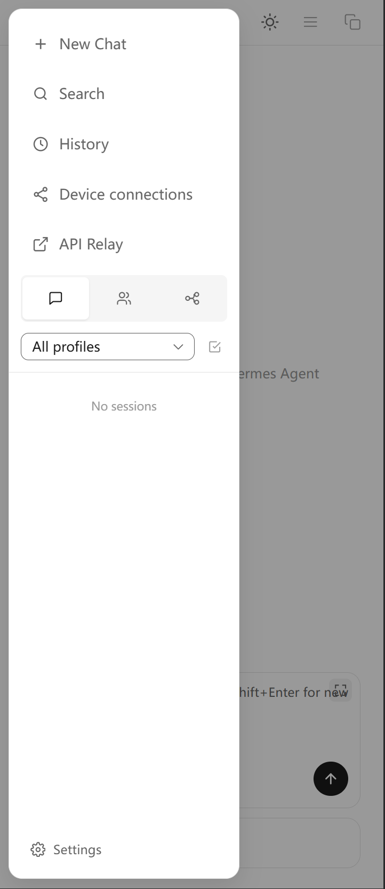
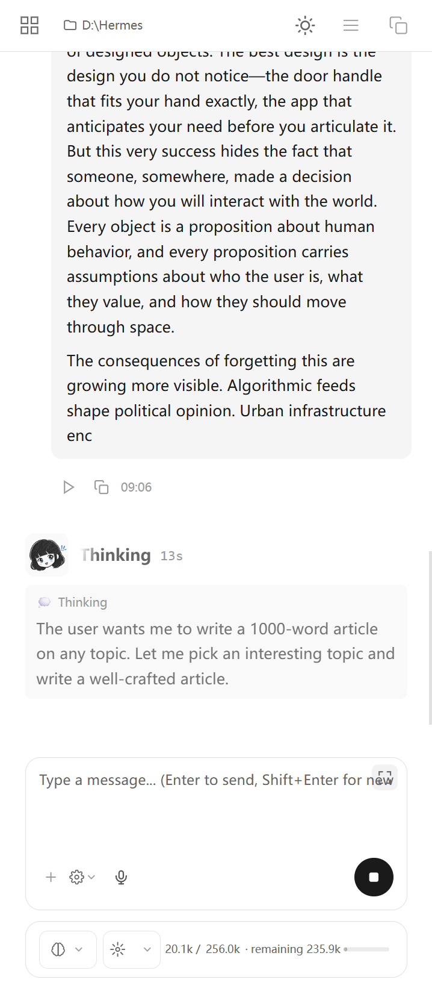
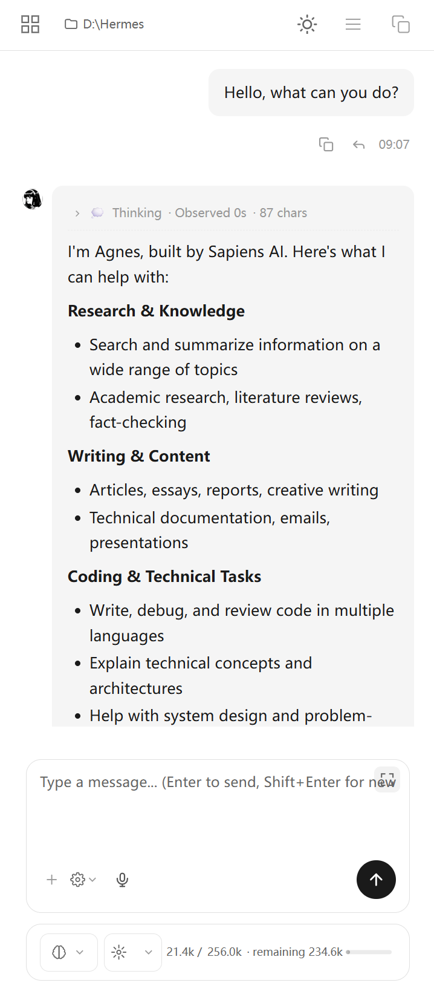
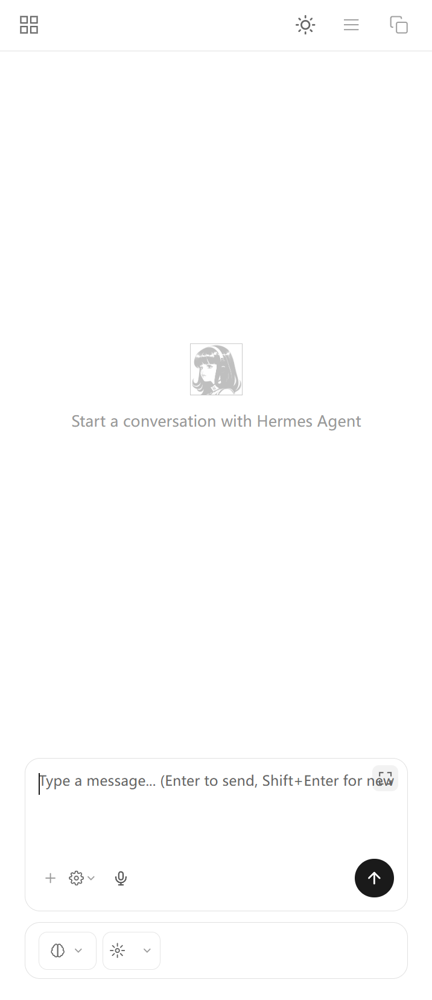
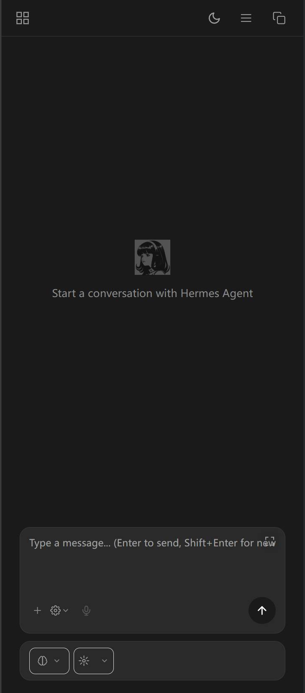

# Hermes Studio Web - Mobile Adaptation

> **Disclaimer**: This project is a mobile web adaptation for [Hermes Studio](https://github.com/EKKOLearnAI/hermes-studio), not an official project. Thanks to the EKKO team for developing this excellent open-source project.

A mobile-optimized web adaptation for Hermes Studio desktop app. Provides a phone-friendly chat interface through an independent `mobile/` directory without modifying the desktop version.

[中文版 README](README.zh-CN.md)

## Features

- 📱 **Mobile-optimized layout** - Chat interface adapted for phone screens
- 🎨 **Dark/Light theme** - Auto-follow system or manual toggle
- 💬 **Full chat functionality** - Message sending, streaming replies, tool calls
- 📂 **Model switching** - Switch LLM models and reasoning depth
- 📊 **Context display** - Real-time token usage
- 🔧 **Input expansion** - One-tap expand for long text editing
- 📋 **Sidebar** - Session management, settings, history

## Project Structure

```
Hermes-Studio-Web/
├── mobile/                 # Mobile pages (independent, update-safe)
│   ├── index.html          # Main page with all mobile CSS/JS
│   ├── app.css             # Base styles
│   ├── chat-page.css       # Chat page styles
│   ├── socket.io.min.js    # WebSocket client
│   └── icons/              # Icon files
├── screenshots/            # Screenshots
│   ├── login.png           # Login screen
│   ├── screenshot1.png     # Main interface
│   └── chat.png            # Chat interface
├── install.bat             # One-click installer
└── README.md               # This file
```

## Installation

### Prerequisites

- Hermes Studio desktop app installed and running (default port `8748`)
- Phone and computer on the same LAN (or use frp tunnel)

### Step 1: Deploy mobile directory

Copy the `mobile/` directory to Hermes Studio's Web UI directory:

```bash
# Windows example
xcopy /E /I mobile "C:\Users\<username>\AppData\Local\Programs\Hermes Studio\resources\webui\dist\client\mobile"

# Or create a directory junction (recommended, update-safe)
mklink /J "C:\Users\<username>\AppData\Local\Programs\Hermes Studio\resources\webui\dist\client\mobile" "C:\path\to\Hermes-Studio-Web\mobile"
```

### Step 2: Access mobile page

- **LAN**: `http://<computer-ip>:8748/mobile/`
  - Example: `http://192.168.1.x:8748/mobile/` (replace x with your IP last segment)
- **External (frp tunnel)**: `http://<server-ip>:8748/mobile/`
  - Example: `http://<your-server-ip-or-domain>:8748/mobile/`

### Step 3: Open on phone browser

Open the URL above in your phone's Safari/Chrome browser.

## Screenshots

| Login | Sidebar | Chatting |
|---------|--------|---------|
|  |  |  |

| Conversation | Light Theme | Dark Theme |
|---------|--------|---------|
|  |  |  |

## Technical Details

### Implementation

1. **Reuse desktop resources** - Load desktop Vite bundle (JS/CSS), no logic duplication
2. **CSS override layer** - Inject mobile adaptation styles in `mobile/index.html`
3. **DOM restructuring** - Use JavaScript to adjust input/toolbar layout
4. **Junction link** - Use Windows directory junction to avoid desktop updates

### Key Features

| Feature | Implementation |
|------|---------|
| Input expansion | Negative margin-top + height expansion, bottom fixed upward growth |
| Model switch alignment | Dynamically read reasoning button width, force consistency |
| Theme switching | CSS variables `--bg-card` / `--text-primary` auto-adapt |
| Send button | Extracted from desktop SVG icons (linear arrow/square) |
| Sidebar | Full-screen drawer, enlarged fonts/icons for touch |

## Maintenance

After desktop updates, if `webui/dist/client/mobile/` is cleared:

1. Recreate junction link:
   ```bash
   mklink /J "C:\Users\<username>\AppData\Local\Programs\Hermes Studio\resources\webui\dist\client\mobile" "C:\path\to\Hermes-Studio-Web\mobile"
   ```

2. Or recopy `mobile/` directory to `webui/dist/client/`

## License & Compliance

**Important**: This project is a mobile adaptation of Hermes Studio, which uses the **Business Source License 1.1 (BSL 1.1)**.

### Allowed Use Cases ✅
- Personal use
- Education
- Research

### Commercial Use Requires License ❌
- Selling or licensing to others
- SaaS hosting
- Embedding in commercial products

> Commercial use requires a separate license from EKKOLearnAI.
> BSL 1.1 converts to Apache License 2.0 on **2029-05-10**.

### Original Project License

- **Hermes Studio**: https://github.com/EKKOLearnAI/hermes-studio/blob/main/LICENSE
- **License type**: Business Source License 1.1 (BSL 1.1)
- **Conversion date**: 2029-05-10 to Apache 2.0

This project's code is MIT License, but Hermes Studio resources must comply with BSL 1.1.

## Acknowledgments

- **[Hermes Studio](https://github.com/EKKOLearnAI/hermes-studio)** - AI assistant desktop app by EKKO, this project is a mobile adaptation of its Web UI
  - GitHub: https://github.com/EKKOLearnAI/hermes-studio
  - Website: https://hermes-studio.ai/
- **[Naive UI](https://www.naiveui.com/)** - Vue component library used in desktop version
  - GitHub: https://github.com/tusen-ai/naive-ui
- **[Socket.IO](https://socket.io/)** - Real-time communication library
  - GitHub: https://github.com/socketio/socket.io

## Related Projects

- [Hermes Studio](https://github.com/EKKOLearnAI/hermes-studio) - Official desktop project
  - GitHub: https://github.com/EKKOLearnAI/hermes-studio
  - Website: https://hermes-studio.ai/
