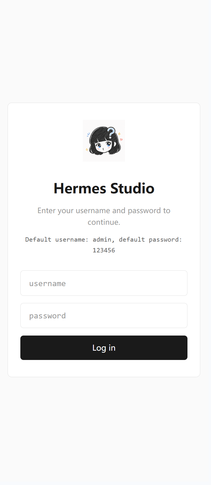
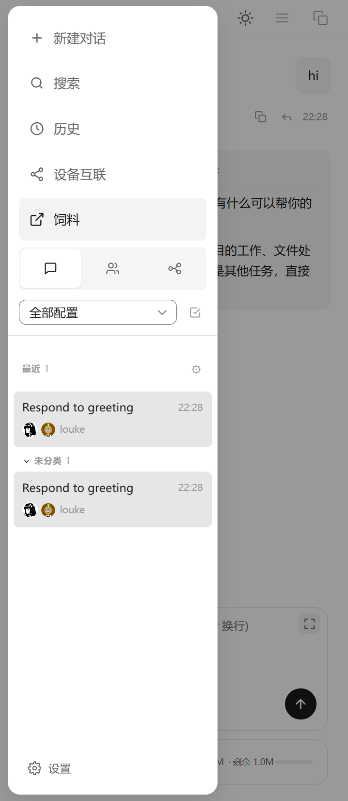
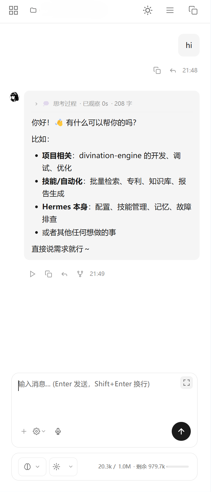

# Hermes Studio Web - Mobile Adaptation

Hermes Studio 桌面版的移动端 Web 适配页面。通过独立的 `mobile/` 目录提供手机优化的聊天界面，无需修改桌面版代码。

## 功能特性

- 📱 **移动端优化布局** - 适配手机屏幕的聊天界面
- 🎨 **深色/浅色主题** - 跟随系统或手动切换
- 💬 **完整聊天功能** - 消息发送、流式回复、工具调用
- 📂 **模型切换** - 支持切换 LLM 模型和思考深度
- 📊 **上下文显示** - 实时显示 token 用量
- 🔧 **输入框展开** - 长文本输入时一键展开编辑
- 📋 **侧边栏** - 会话管理、设置、历史记录

## 项目结构

```
Hermes-Studio-Web/
├── mobile/                 # 移动端页面（独立目录，更新安全）
│   ├── index.html          # 主页面（含所有移动端适配 CSS/JS）
│   ├── app.css             # 基础样式
│   ├── chat-page.css       # 聊天页面样式
│   ├── socket.io.min.js    # WebSocket 客户端
│   └── icons/              # 图标文件
├── screenshots/            # 软件截图
│   ├── login.png           # 登录界面
│   ├── screenshot1.png     # 主界面
│   └── screenshot2.png     # 聊天界面
└── README.md               # 本文件
```

## 安装方法

### 前置要求

- Hermes Studio 桌面版已安装并运行（默认端口 `8748`）
- 手机和电脑在同一局域网（或使用 frp 穿透）

### 步骤 1：放置 mobile 目录

将 `mobile/` 目录复制到 Hermes Studio 的 Web UI 目录：

```bash
# Windows 示例
xcopy /E /I mobile "C:\Users\<用户名>\AppData\Local\Programs\Hermes Studio\resources\webui\dist\client\mobile"

# 或者创建目录链接（推荐，更新安全）
mklink /J "C:\Users\<用户名>\AppData\Local\Programs\Hermes Studio\resources\webui\dist\client\mobile" "C:\path\to\Hermes-Studio-Web\mobile"
```

### 步骤 2：访问移动端页面

- **局域网**: `http://<电脑IP>:8748/mobile/`
  - 示例: `http://192.168.1.109:8748/mobile/`
- **外网（frp 穿透）**: `http://<服务器IP>:8748/mobile/`

### 步骤 3：手机浏览器打开

用手机 Safari/Chrome 打开上述地址即可。

## 界面截图

| 登录界面 | 主界面 | 聊天界面 |
|---------|--------|---------|
|  |  |  |

## 技术说明

### 实现原理

1. **复用桌面版资源** - 加载桌面版的 Vite bundle（JS/CSS），不重复实现逻辑
2. **CSS 覆盖层** - 在 `mobile/index.html` 中注入移动端适配样式
3. **DOM 重组** - 用 JavaScript 调整输入框、工具栏的布局结构
4. **Junction 链接** - 用 Windows 目录链接避免桌面版更新覆盖

### 关键特性

| 特性 | 实现方式 |
|------|---------|
| 输入框展开 | 负 margin-top + 高度扩展，底部固定向上生长 |
| 模型切换对齐 | 动态读取思考等级按钮宽度，强制一致 |
| 主题切换 | CSS 变量 `--bg-card` / `--text-primary` 自动适配 |
| 发送按钮 | 提取桌面版 SVG 图标（线性箭头/方块） |
| 侧边栏 | 全屏抽屉化，字体/图标放大适配触摸 |

## 更新维护

桌面版更新后，如果 `webui/dist/client/mobile/` 被清除：

1. 重新创建 junction 链接：
   ```bash
   mklink /J "C:\Users\<用户名>\AppData\Local\Programs\Hermes Studio\resources\webui\dist\client\mobile" "C:\path\to\Hermes-Studio-Web\mobile"
   ```

2. 或者重新复制 `mobile/` 目录到 `webui/dist/client/`

## 许可证

MIT License - 与 Hermes Studio 保持一致

## 相关项目

- [Hermes Studio](https://github.com/NousResearch/hermes-agent) - 桌面版主项目
